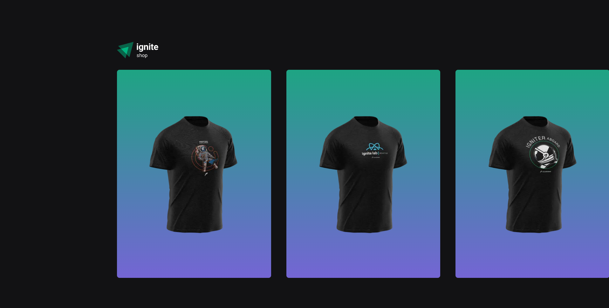
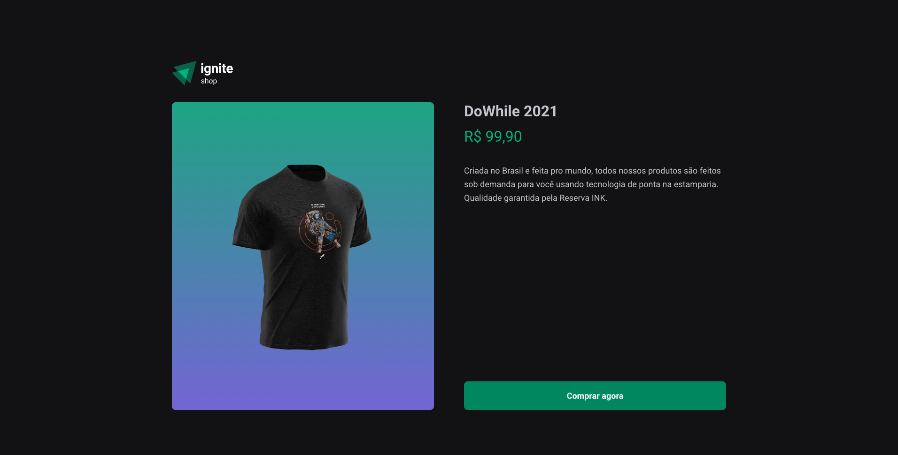
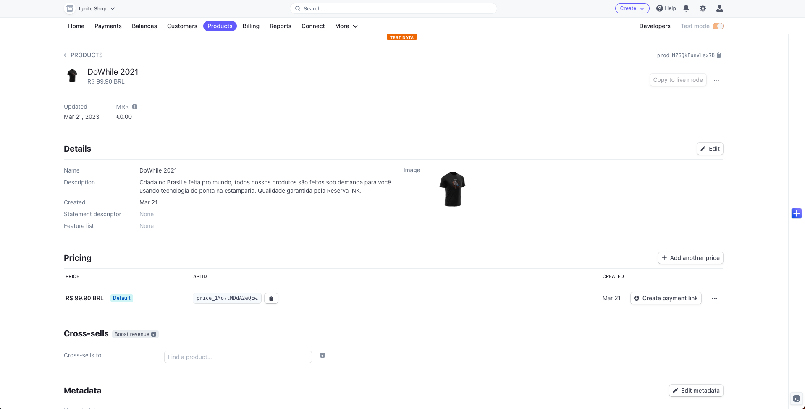

<h3 align="center">
  Next.js Ignite Shop

## :rocket: Project developed in Rocketseat's Ignite program

During the Ignite program, the immersion of Next.js brought the development of a simple application with React, Next.js and Stripe to simulate the flow of a checkout in a real environment of an online store.

Below is a preview of how the application looks.

